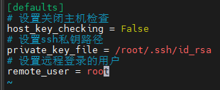

# ansible_demo

一个关于旨在探索使用Ansible进行自动化配置管理能力的实验记录

# 关于旨在探索使用Ansible进行自动化配置管理能力

## 摘要

本实验旨在探索使用Ansible进行自动化配置管理的能力。为了达到这个目标，我们选择了使用Docker和Docker Compose来创建和管理一个容器化环境，并通过Ansible连接和管理这些容器。

在实验中，我们首先使用Dockerfile创建了一个包含SSH服务的Docker镜像。接下来，我们使用Docker Compose编排了三个容器，构建了一个容器集群。最后，我们使用Ansible的Ping模块对这些容器的状态进行了检测。

## 引言

自动化配置管理成为现代系统管理中的重要课题，它可以显著提高系统配置和部署的效率、减少操作失误带来的问题，同时也为IT操作人员提供了更多的时间和精力投入到更有价值的任务中。为了满足这一需求，出现了各种各样的自动化工具和平台，其中Ansible作为一种流行的自动化配置管理工具，受到了广泛的关注和应用。

Ansible是一种易于使用且功能强大的自动化工具，可实现系统配置、应用部署、服务管理和编排等任务。它基于SSH协议实现远程托管，在管理主机上不需要安装额外的代理程序，使其部署和使用变得更加简单和灵活。此外，Ansible具有基于YAML的描述语言，使得编写和维护任务文件变得简单易懂。

本实验旨在探索Ansible在自动化配置管理中的应用。为了更好地展示Ansible的能力，我们采用了Docker和Docker Compose这两项流行的容器化技术。Docker是一种轻量级的虚拟化方案，可以将应用程序和其依赖项打包成一个独立的容器，并提供了快速部署和可移植性的优势。Docker Compose则提供了一个简单的方式来定义和管理多个Docker容器之间的依赖关系和通信。

通过结合Ansible、Docker和Docker Compose，我们可以实现快速部署和配置多个容器化应用、构建复杂的容器集群，并通过Ansible的自动化能力实现对容器的管理和状态检测。这将极大地简化了系统部署和配置的过程，并提供了一种可扩展且灵活的方式来管理和监控容器化环境。

在接下来的实验步骤中，我们将使用Dockerfile创建一个带有SSH服务的Docker镜像，使用Docker Compose定义和编排三个Docker容器，并使用Ansible连接和管理这些容器。通过使用Ansible的Ping模块，我们将对容器的状态进行检测，以验证Ansible在自动化配置管理中的实际效果。

希望通过本实验的研究，能够了解Ansible、Docker和Docker Compose的优势和应用，为自动化配置管理提供更好的解决方案。

## 实验前准备

在本实验中，我将使用阿里云ecs作为宿主机。由于实验需要用到Docker Engine和Docker Compose，所以我提前安装好了。下面的实验将不会包括以上步骤。这些步骤可以参考上一个实验。
[关于Compose实现负载均衡器和web应用](https://github.com/jiuyue1123/haproxy_web)

## 实验步骤

### 步骤一：使用Dockerfile创建一个带有SSH服务的Docker镜像

#### 创建工作目录

```sh
# 创建一个sshd_debian的工作目录
mkdir sshd_debian
$ 进入工作目录
cd sshd_debian
# 创建run.sh脚本和Dockerfile。其中run.sh用来当做启动脚本，Dockerfile用来定义ssh镜像
touch run.sh Dockerfile
```

#### 编写run.sh和authorized_keys文件

```sh
# 在run.sh中写入以下内容

#!/bin/bash
/usr/sbin/sshd -D

# 在宿主机上生成密钥对，并创建authorized_keys文件
ssh-keygen -t rsa
...经过一顿回车之后
cat ~/.ssh/id_rsa.pub > authorized_keys
```


#### 编写Dockerfile并且创建镜像

```sh
# 编辑Dockerfile
vim Dockerfile
```

输入以下内容

```Dockerfile
# authors: nanak <2152598815@qq.com>
# github <github.com/jiuyue112>
# update: 2023-07-20

#这个镜像使用ustc下载会更快
F# authors: nanak <2152598815@qq.com>
# github <github.com/jiuyue112>
# update: 2023-07-20

#这个镜像使用ustc下载会更快
FROM nanak112/debian:ustc

MAINTAINER nanak (giehub.com/jiuyue1123)

RUN apt-get update -y \
&& apt-get install openssh-server python3 -y \
#必须创建这个目录否则无法启动ssh
&& mkdir -p /var/run/sshd \ 
#创建这个目录用来保存公钥
&& mkdir -p /root/.ssh 

ADD authorized_keys /root/.ssh/authorized_keys
ADD run.sh /run.sh
RUN chmod 755 /run.sh

CMD ["/run.sh"]
```

编译镜像

```sh
docker build -t sshd:node .
```


经过测试镜像是符合预期的


### 步骤二：使用Docker Compose定义和编排三个Docker容器

#### 在用户的home目录创建docker compose的工作目录

```sh
# 创建工作目录，注意：此时的目录为~/sshd_debian。
mkdir ~/sshd_nodes
# 将sshd_debian放在sshd_nodes下面
cd && mv sshd_debian sshd_nodes/
```

现在的目录结构像这样


#### 编写docker-compose.yml

```sh
vim docker-compose.yml
```

写入以下内容

```yaml
# authors: nanak <2152598815@qq.com>
# github <github.com/jiuyue112>
# update: 2023-07-20

version: "3"
services:
  node1:
    build: ./sshd_debian
    expose:
      - 22

  node2:
    build: ./sshd_debian
    expose:
      - 22

  node3:
    build: ./sshd_debian
    expose:
      - 22
```

#### docker-compose启动！

```sh
docker-compose up
```


经过验证sshd容器符合预期


### 步骤三：使用Ansible连接这些容器

#### 安装ansible

```sh
apt install ansible -y
```

#### 编辑主机清单（inventory）

```sh
mkdir /etc/ansible
vim /etc/ansible/hosts
```

写入对应的主机

```
172.19.0.2
172.19.0.3
172.19.0.4
```

验证生效


#### 配置ansible使其能够连接sshd_node
```sh
# 打开配置文件
vim /etc/ansible/ansible.cfg
```

输入以下内容



不通重启服务

#### ansible启动！

```sh
# 使用ansible的ping模块验证是否成功连接受管节点
ansible all -m ping
```

**结果：**


**至此结束**

#### 一些问题
如下图所示


看提示警告是由于受控节点没有python的原因，错误则是因为ssh密钥的问题。解决方案：
1. 在受控节点上安装python即可
2. 检查ssh密钥是否过期
3. 检查ansible的ssh配置是否正确

# 贡献者
[](https://github.com/jiuyue1123)
[](https://github.com/jiuyue1123)